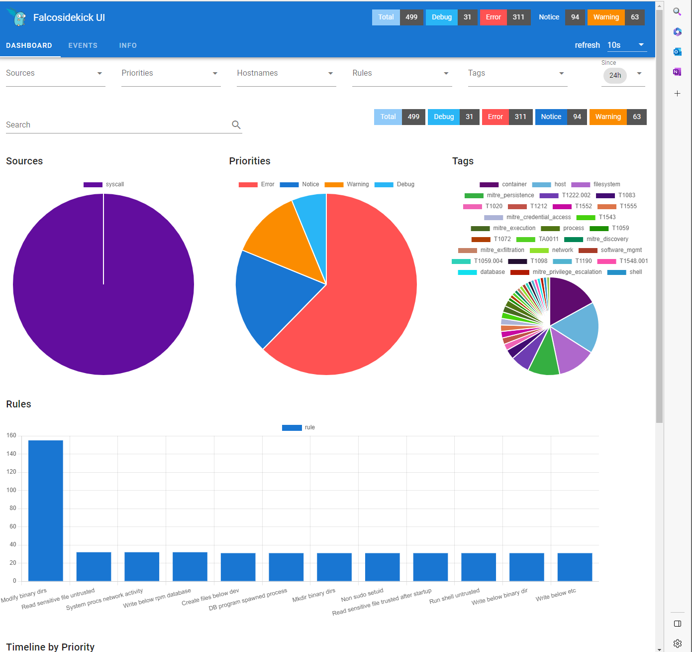

# Falco Demo


This is a demo of setting up and showcasing some of the capabilities of Falco for runtime threat detection.

## devcontainer

This demo shows how to use Kyverno to enforce policies on Kubernetes resources. You can use the devcontainer following this repo. The devcontainer has all the tools installed to run the demo. 

## Create a cluster

There are some secrets and setups needed to get this repo going.

1. Clone/Fork this repo
2. Create an RG in Azure and note down the name
3. Create a GitHub secret holding an Azure Service Principal following this guide: <https://github.com/Azure/actions-workflow-samples/blob/master/assets/create-secrets-for-GitHub-workflows.md> giving it access to the RG in step 2.

Create GH Action secrets with the following values:

- AZURE_CREDENTIALS
- AZURE_SUBSCRIPTION_ID
- AZURE_TENANT_ID

## Get the kubeconfig

## Install Falco using Helm

Following the instructions [here](https://falco.org/docs/getting-started/try-falco/try-falco-on-kubernetes/) to install Falco using Helm.

```bash
helm repo add falcosecurity https://falcosecurity.github.io/charts
helm repo update
helm search repo falcosecurity
```

Shows us the following:

```bash
NAME                            CHART VERSION   APP VERSION     DESCRIPTION
falcosecurity/event-generator   0.2.0           0.10.0          A Helm chart used to deploy the event-generator...
falcosecurity/falco             3.1.4           0.34.1          Falco
falcosecurity/falco-exporter    0.9.3           0.8.2           Prometheus Metrics Exporter for Falco output ev...
falcosecurity/falcosidekick     0.6.1           2.27.0          Connect Falco to your ecosystem
```

Then we install Falco with the sidekick ui:

```bash
kubectl create namespace falco
helm install falco -n falco --set tty=true --set falcosidekick.enabled=true --set falcosidekick.webui.enabled=true falcosecurity/falco
```

generate a suspicous event:

```bash
kubectl run event-generator -n falco --image falcosecurity/event-generator \
  -- run syscall --loop
```

We can see the event in the Falco UI:

